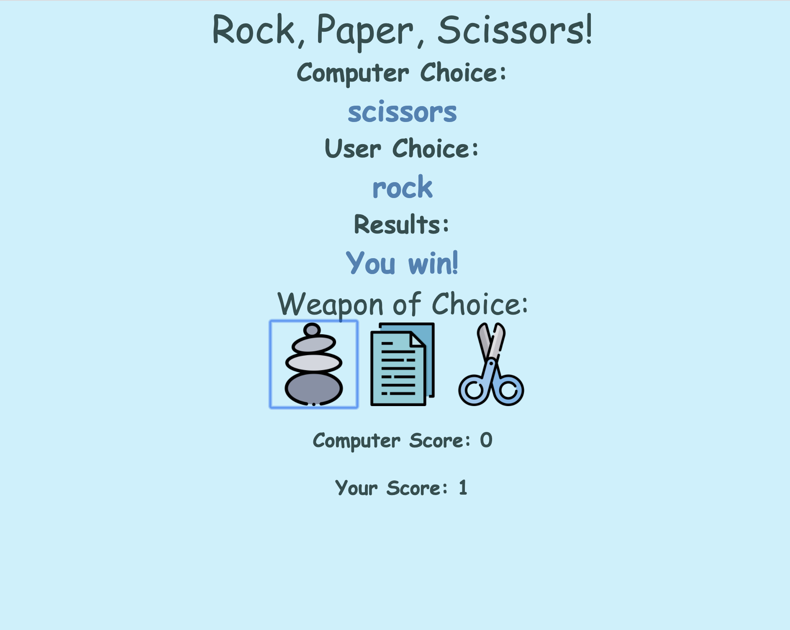

# Rock-Paper-Scissors-app
This is Rock-Paper-Scissors app written in Javascript, HTML, and CSS.

Click <a href="https://mauroleos.github.io/Rock-Paper-Scissors-app//">here</a> to see website.

# Summary
  This is a Rock, Paper, Scissors game that allows a user to choose between rock, paper, or scissors. Once the user selects between rock, paper, or scissors, the JavaScript function will also randomly makes a selection. Finally, the choices are compared and the winner is displayed to the screen.
  This app really gave me the oppurtunity to really dive deep into Javascript and gain a better understanding on how it works. This game takes a user input by collecting the "id" of a clicked image (rock, paper, or scissors), compares that to the computers randomly generated choice, and then displays the results to the screen. The user has the option to play as many times as they like. I had an incredible time working on this application!

# Author
<strong>Mauro Leos</strong>-<i>Full-Stack Software Developer</i>-<a href="https://www.linkedin.com/in/mauro-leos-b4103a11b/">LinkedIn</a>
